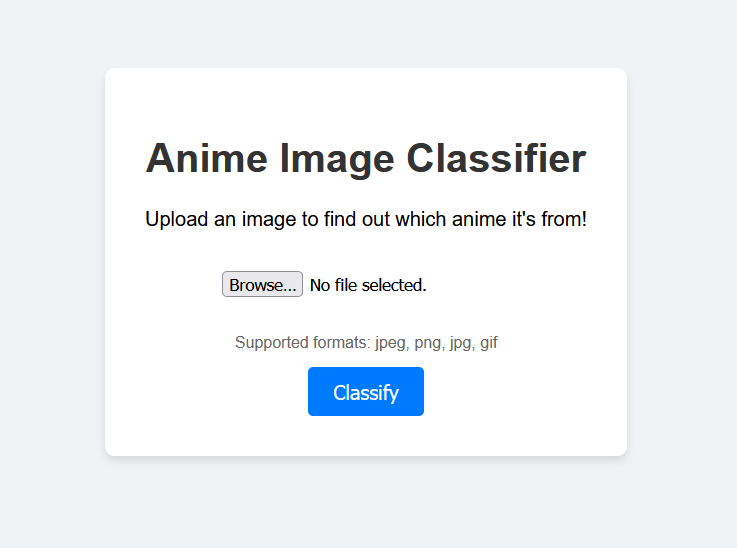
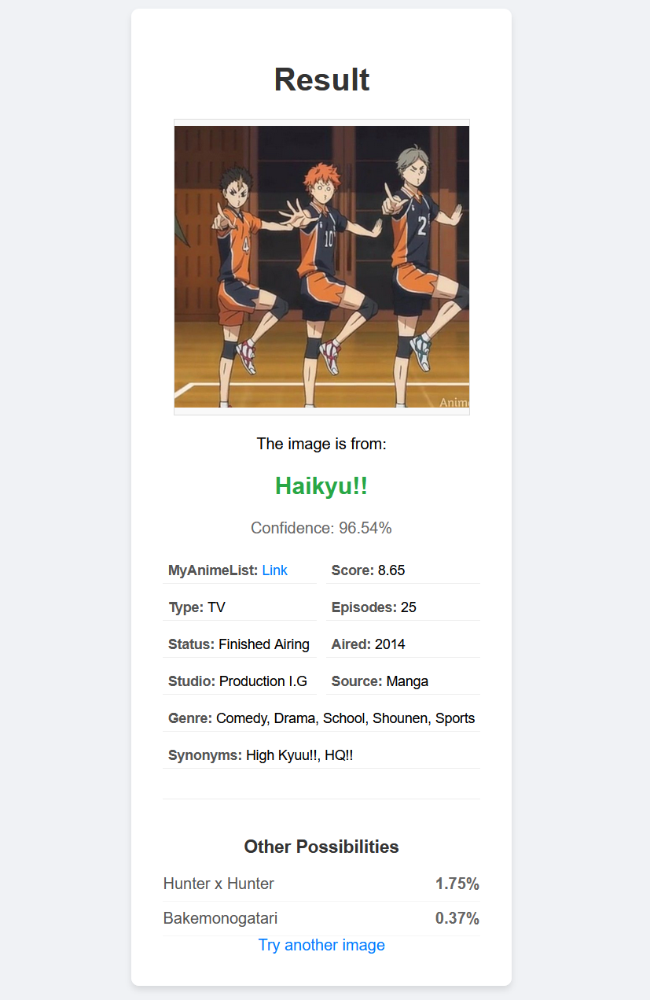

# Anime Classifier

A deep learning-based web application that identifies anime series from images using a fine-tuned ResNet50 model.

## What it Does

This project provides a web interface for users to upload images of anime characters or scenes. The backend, powered by a PyTorch ResNet50 model, analyzes the image and predicts which anime series it belongs to from a set of 30 supported classes. Upon classification, the application displays the predicted anime title, the model's confidence score, and detailed metadata about the series, including its genre, studio, rating, and airing status.

## Quick Start

To run this project locally (suggest venv), follow these steps:

1.  **Clone the repository**
2.  **Install dependencies**:
    Ensure you have Python installed, then run:
    ```bash
    pip install -r requirements.txt
    ```
3.  **Run the application**:
    Navigate to the project root and execute:
    ```bash
    python src/app.py
    ```
4.  **Access the web interface**:
    Open your web browser and go to `http://127.0.0.1:5000`.

### Screenshots

**Home Page**


**Result Page**


## Video Links

*   **Demo Video**: [Link to Demo Video]
*   **Technical Walkthrough**: [Link to Technical Walkthrough]

## Evaluation

The model was evaluated on a test set of over 11000 anime images.

Detailed analysis with training curves, confusion matrix, testing evaluation, etc. please refer to the [notebook](notebooks/anime_classifier_model.ipynb).

*   **Final Test Accuracy**: 58.26%
*   **Average Test Loss**: 1.9703

### Error Analysis
The model sometimes confuses anime with similar art styles or character designs. The top misclassifications include:
*   **Kamisama Kiss** predicted as **Nichijou**
*   **Attack on Titan** predicted as **Steins Gate**
*   **Bakemonogatari** predicted as **Haikyu!!**
*   **Clannad** predicted as **Nana**
*   **Death Note** predicted as **Maid Sama!**

## Individual Contributions

*   **Derek He**: I solod it